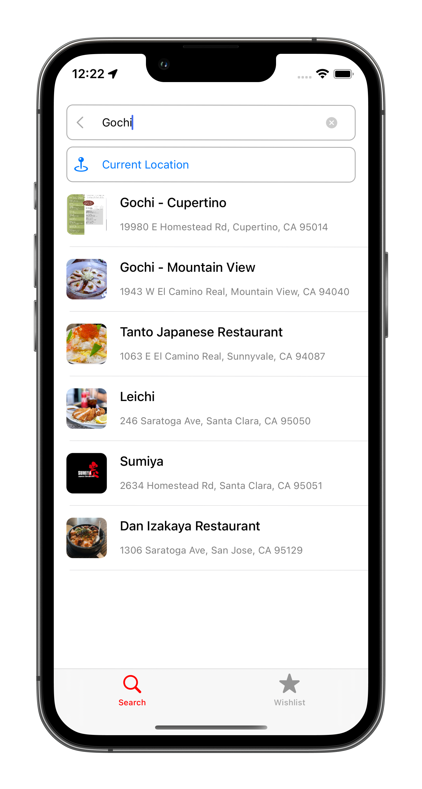

# FoodApp-iOS

FoodApp is an iOS app that helps you track what restaurants you have tried and would like to try next.

## Technologies used
*UIKit, Core Data, CoreLocation, MapKit, Yelp Rest API, WidgetKit*

## Features
- Save images to restaurants to keep track of foods you have tried.
- Add restaurants to your wish list to keep track of restaurants you would like to try.
- Open the map to see if there are any restaurants in your wish list that are near by. (comes in handy if your traveling)
- Widget that displays the images you have saved to remind you of the good times of eating good food.

  
   
  
  
  
  
  

